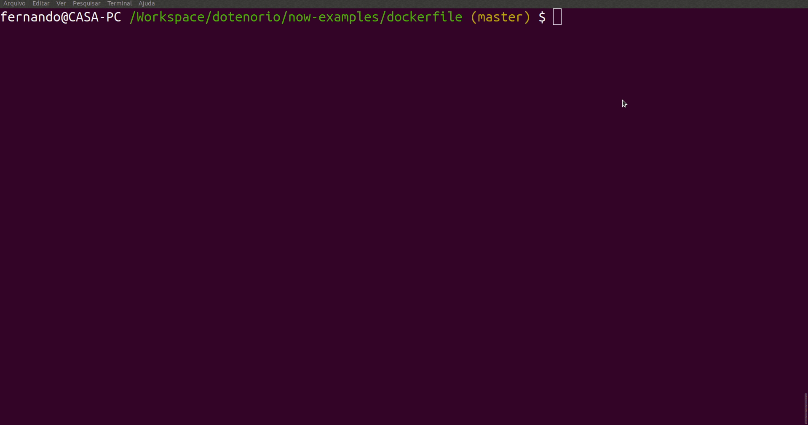

▲ Dockerfile
----

To run, just execute:

```
$ yarn i
$ now
```

You can use `$ yarn start` on `/app` folder to see this server locally:

```
$ yarn start

> @ start path\to\now-examples\dockerfile\app
> micro

micro: Accepting connections on port 3000
```

## Example


